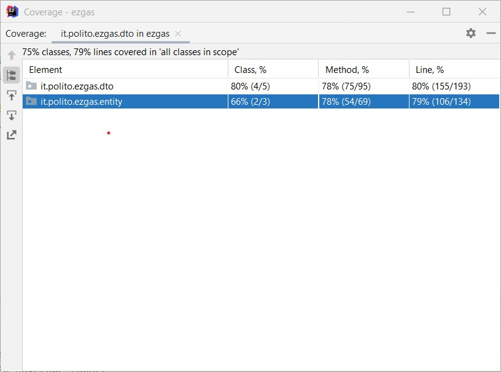
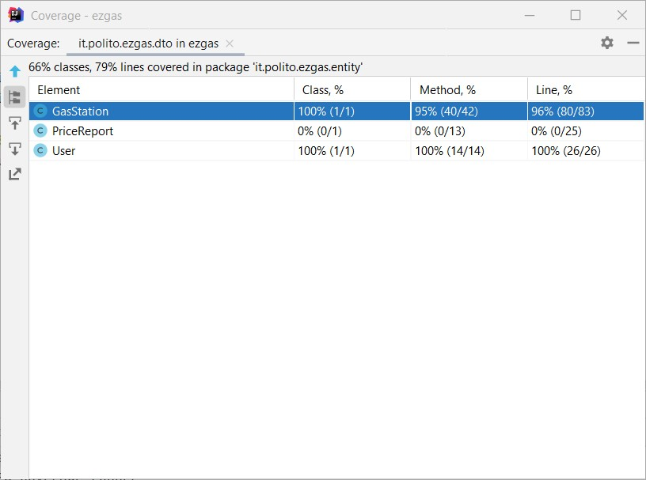

# Unit Testing Documentation

Authors: Filippo Fontan, Giuseppe Pipero, Iman Ostovar, Matteo Pappadà

Date: 19/05/2020

Version: 2

| Version | Changes                                                     |
| ------- | :---------------------------------------------------------- |
| 2       | Increased Unit tests coverage                                |

# Contents

- [Black Box Unit Tests](#black-box-unit-tests)

- [White Box Unit Tests](#white-box-unit-tests)

# Black Box Unit Tests

    Since most of tests are related to setter methods, which are really similar among them (set boolean, double, String values) just few methods are reported here.

 ### **Class *User* - method *setReputation***

**Criteria for method *setReputation*:**
	
 - Sign of reputation
 - Type of reputation
 - Value of reputation

**Predicates for method *setReputation*:**

| Criteria | Predicate |
| -------- | --------- |
|Sign of reputation| > 0|
|          |        < 0    |
|    Type of reputation      |      Integer     |
|          |      All others     |
|     Value of reputation     |     >= minInt && <= maxInt      |
|          |     > maxInt      |
|          |     < minInt      |

**Boundaries**:

| Criteria | Boundary values |
| -------- | --------------- |
|    Value of reputation      |       minInt, maxInt, minInt + 1, maxInt + 1          |

**Combination of predicates**:

| Type of reputation | Sign of reputation | Value of reputation | Valid / Invalid | Description of the test case | JUnit test case |
|-------|-------|-------|-------|-------|-------|
| Integer | > 0 | >= minInt && <= maxInt | V | setReputation(3) --> OK | it.polito.ezgas.entity.UserTest.java|
| Integer | > 0 | > maxInt | I | setReputation(99999999) --> Exception | it.polito.ezgas.entity.UserTest.java|
| Integer | < 0 | >= minInt && <= maxInt | V | setReputation(-3) --> OK | it.polito.ezgas.entity.UserTest.java|
| Integer| < 0 | < minInt | I | setReputation(-99999999) --> Exception | it.polito.ezgas.entity.UserTest.java|
| All others | ... | ... | I | setReputation("ciao") --> Exception | it.polito.ezgas.entity.UserTest.java|

 ### **Class *User* - method *setAdmin***

**Criteria for method *setAdmin*:**
	
 - Type of admin
 - Value of admin

**Predicates for method *setAdmin*:**

| Criteria | Predicate |
| -------- | --------- |
|Type of admin| Boolean |
|          |       All others    |
|    Value of admin      |      True     |
|          |      False     |

**Boundaries**:

| Criteria | Boundary values |
| -------- | --------------- |

**Combination of predicates**:

| Type of admin | Value of admin | Valid / Invalid | Description of the test case | JUnit test case |
|-------|-------|-------|-------|-------|
| Boolean | True | V | setAdmin(true) --> OK | it.polito.ezgas.entity.UserTest.java|
| Boolean | False | V | setAdmin(false) --> OK | it.polito.ezgas.entity.UserTest.java|
| All others | ... | I | setAdmin("no") --> Exception | it.polito.ezgas.entity.UserTest.java|

### **Class *User* - method *setEmail***

**Criteria for method *setEmail*:**

 - Type of email

**Predicates for method *setEmail*:**

| Criteria | Predicate |
| -------- | --------- |
|Type of email| String|
|          |        All others    |

**Boundaries**:

| Criteria | Boundary values |
| -------- | --------------- |

**Combination of predicates**:

| Type of email | Valid / Invalid | Description of the test case | JUnit test case |
|-------|-------|-------|-------|
| String | V | setEmail("email@mail.com") --> OK | it.polito.ezgas.entity.UserTest.java|
| String | I | setEmail(3343) --> Exception | it.polito.ezgas.entity.UserTest.java|

### **Class *GasStation* - method *setLat (setLon)***

**Criteria for method *setLat (setLon)*:**

 - Type of lat
 - Sign of lat
 - Value of lat

**Predicates for method *setLat (setLon)*:**

| Criteria | Predicate |
| -------- | --------- |
|Sign of lat | > 0|
|          |        < 0    |
|    Type of lat      |      Double     |
|          |      All others     |
|     Value of reputation     |     >= minDouble && <= maxDouble      |
|          |     > maxDouble      |
|          |     < minDouble      |

**Boundaries**:

| Criteria | Boundary values |
| -------- | --------------- |
|    Value of reputation      |       minDouble, maxDouble, minDouble + 1, maxDouble + 1          |

### **Class *GasStation* - method *setGasPrice (and similar)***

**Criteria for method *setGasPrice*:**

 - Type of price
 - Sign of price
 - Value of price

**Predicates for method *setGasPrice*:**

| Criteria | Predicate |
| -------- | --------- |
|Sign of price | > 0|
|          |        < 0    |
|    Type of price      |      Double     |
|          |      All others     |
|     Value of price     |     >= minDouble && <= maxDouble      |
|          |     > maxDouble      |
|          |     < minDouble      |

**Boundaries**:

| Criteria | Boundary values |
| -------- | --------------- |
|    Value of price      |       minDouble, maxDouble, minDouble + 1, maxDouble + 1          |

**Combination of predicates**:

| Type of reputation | Sign of reputation | Value of reputation | Valid / Invalid | Description of the test case | JUnit test case |
|-------|-------|-------|-------|-------|-------|
| Double | > 0 | >= minDouble && <= maxDouble | V | setGasPrice(1.567) --> OK | it.polito.ezgas.entity.GasStationTest.java|
| Double | > 0 | > maxDouble | I | setGasPrice(99999999) --> Exception | it.polito.ezgas.entity.GasStationTest.java|
| Double | < 0 | >= minDouble && <= maxDouble | I | setGasPrice(-3.2) --> Exception | it.polito.ezgas.entity.GasStationTest.java|
| Double| < 0 | < minDouble | I | setGasPrice(-99999999) --> Exception | it.polito.ezgas.entity.GasStationTest.java|
| All others | ... | ... | I | setGasPrice("price123") --> Exception | it.polito.ezgas.entity.GasStationTest.java|

# White Box Unit Tests

### Test cases definition

| Unit name | JUnit test case |
|--|--|
|GasStation |it.polito.ezgas.entity.GasStationTest.java (testGasStation()) |
|User |it.polito.ezgas.entity.UserTest.java (testUser()) |
|GasStationDto |it.polito.ezgas.dto.GasStationDtoTest.java (testGasStationDto()) |
|IdPw |it.polito.ezgas.dto.IdPwTest.java (testIdPw()) |
|LoginDto |it.polito.ezgas.dto.LoginDtoTest.java (testLoginDto()) |
|UserDto |it.polito.ezgas.dto.UserDtoTest.java (testUserDto()) |

### Code coverage report

### Loop coverage analysis

    <Identify significant loops in the units and reports the test cases
    developed to cover zero, one or multiple iterations >

|Unit name | Loop rows | Number of iterations | JUnit test case |
|---|---|---|---|
|||||
|||||
||||||

